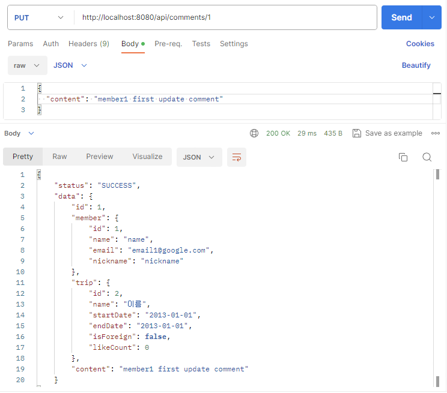

# TravelApp

## 📍 소개

***
**프로젝트 내용**: 여행 여정을 기록, 관리하는 SNS 서비스

**프로젝트 주제 및 필수 구현 기능 제안**: 야놀자

**프로젝트 목적**: Spring Security, JWT, JUnit, OpenApi 활용

**프로젝트 기간**: 2023년 11월 10일 (월) ~ 11월 16일(목)

### 기술 스택

- **언어**: Java 17
- **개발 환경**: IntelliJ, Gradle, Spring Boot 3
- **라이브러리**: Spring Web, Spring Security, JPA, JUnit5, Lombok, MapStruct, JWT, Redis
- **CI**: GitHub Actions
- **API 명세** : Swagger

### API 명세

### 로컬 데이터베이스 H2 접속 경로

1. http://localhost:8080/h2-console 에 들어간다.
2. 아래 정보대로 입력 칸을 채우고 Connect를 누른다.

- Driver Class: org.h2.Driver
- JDBC URL: jdbc:h2:mem:test;MODE=MYSQL
- User Name: sa
- Password: (빈칸)

## ⚖️ [컨벤션](https://github.com/FC-BE-ToyProject-Team8/TravelApp/wiki)

----

### 1. 코딩 컨벤션

- 커스텀 구글 코딩 컨벤션을 사용합니다.

### 2. API 설계

- WIKI :  https://github.com/FC-BE-ToyProject-Team8/TravelApp/wiki/API-%EC%84%A4%EA%B3%84
- Swagger : http://localhost:8080/swagger-ui/index.html

### 3. Git Flow

- 브랜치 전략으로 Git Flow를 사용합니다
- 다만, 프로젝트의 규모상 버전을 관리하는 release, 버그를 수정하는 hotfix 브랜치는 따로 생성하지 않았습니다.
- 모든 팀원의 Approve를 받아야 main에 Merge 할 수 있습니다.

### <브랜치별 역할>

### `feature/#`

- 실제 작업을 하는 브랜치
- 이슈 번호가 1이라면 feature/1로 만들면 된다.
- 'develop'을 베이스 브랜치로 하여 만들어야 한다.
    - ( 브랜치 생성은 베이스 브랜치[ 체크아웃되어있는 브랜치 ]를 기준으로 만들어진다.)
- 작업이 완료되면 develop으로 Pull Request를 날린다.
- 4명의 Approve를 받았다면 Merge한다.

### `develop`

- 다음 버전 개발을 위해 main으로 가기 전 기능 코드들을 모아두는 브랜치
- 작성한 기능이 잘 작동되는지 확인하고, main으로 PR 및 Merge를 하면 된다.
- main으로 Pull Request를 날릴때는 Approve 받는 것은 선택사항이다.

### `main`

- 실제 서비스를 운영할 수 있는 브랜치
- main에 배포가 되고 나서도 기능이 잘 작동하는지 확인해야 한다.

### 4. 테스트 코드

- **Repository**: `@Query` 어노테이션 등을 사용한 메서드에 대해 테스트 코드 작성 필수
- **Service**: 단순 Repository 메서드 호출 이상의 로직을 수행하는 메서드에 대해 테스트 코드 작성 필수
- **Controller**: 모든 public 메서드 테스트 코드 작성 필수

### 5. 성공/오류 코드 번호

- **200** : 모든 성공
- **400** : 클라이언트가 입력을 잘못한 경우
- **401** : 인증 정보가 없는 경우
- **403** : 접근 권한이 없는 경우
- **500** : 서버 내부 에러

### 6. 기타 합의사항

- **협업 관련**
    - 데일리 스크럼: 매일 오전 10:00 Slack에 진행상황 공유
        
- **커밋 메시지 관련**
    - 커밋 제목은 `prefix: 커밋 메시지` 형태로 합니다.
    - prefix의 목록과 각각의 용도는 IntelliJ 플러그인에서 볼 수 있습니다.
    - IntelliJ 플러그인 적용법: https://blog.naver.com/rinjyu/222157082860
    - 커밋 내용을 자세하게 적습니다. (커밋 제목과 내용만 보더라도 코드 내용이 파악 가능할 정도로)

## 🗺️ 기획안

---

## ERD

- `create_at`/`update_at` 컬럼은 자동으로 값을 넣어주기 위해`JPA Auditing` 기능을 사용하였습니다.

## 초기 실행 화면

## API 테스트

### `POST /signup` 회원가입

- 회원가입 (요청/응답 - 성공)

- 회원가입 (요청/응답 - 실패 *이미 존재하는 닉네임*)
  

- 회원가입 (요청/응답 - 실패 *이미 존재하는 이메일*)
  

### `POST /login` 로그인

- 로그인 (요청/응답 - 성공)

- 로그인 (요청/응답 - 실패 *잘못된 비밀번호*)

- 로그인 (요청/응답 - 실패 *존재하지 않는 사용자*)

### `POST /reissue` 토큰 재발급

### `POST /trips` 여행 등록

### `POST /itineraries` 여정 복수 추가

### `PUT /trips/{tripId}` 여행 수정

### `PUT /itineraries/{itineraryId}` 여정 수정

### `GET /trips` 여행 목록 조회

### `GET /trips/{tripid}` 여행+여정 조회

### `GET /trips/my-likes?page={page}` 좋아요 누른 여행 조회

### `DELETE /trips/{tripId}` 여행 삭제

### `DELETE /itineraries/{itineraryId}` 여정 삭제

### `POST /likes?tripId={tripId}` 좋아요 등록

### `DELETE /likes?tripId={tripId}` 좋아요 삭제

### `POST /comments?tripId={tripId}` 댓글 등록

- 타인의 여행 정보에 댓글 작성 확인
  

### `PUT /comments/{commentId}` 댓글 수정

### `DELETE /comments/{commentId}` 댓글 삭제

### `GET /trips/search-by-nickname?query={query}&page={page}` 사용자 닉네임으로 여행 검색

### `GET /trips/search-by-trip-name?query={query}&page={page}` 여행 이름으로 여행 검색

### `GET /search-place?query={query}&page={page}&size={size}` 장소 검색

- 카카오 OpenApi를 이용한 키워드를 통한 장소 검색
  

----

## 🖥 평가항목 별 커멘트

---

| 구분       | 내용                                                                                                                                                                                                                            |
|----------|-------------------------------------------------------------------------------------------------------------------------------------------------------------------------------------------------------------------------------|
| API 설계   | **REST API URL 설계 규칙에 어긋나지 않게 URL이 잘 구현되었는가.**                                                                                                                                                                                |
|          | -> 네, 리소스에 대한 표현은 현업 컨벤션과 맞게 복수형 명사로 구성하였고, 추가 사항으로 프론트 구현도 생각에 두어 모든 API앞에 /api를 붙여주었습니다.                                                                                                                                    |
|          | **적절한 HTTP method를 사용했는가**                                                                                                                                                                                                    |
|          | -> 데이터 조회 시 GET, 추가 시 POST, 삭제 시 DELETE를 사용했고, 업데이트 시 PATCH가 아닌 PUT을 사용하여 클라이언트로부터 모든 필드의 정보를 받아 기존 리소스를 완전히 대체하는 방식으로 구현하였습니다.                                                                                               |
| ERD 설계   | **각 테이블의 모든 컬럼들이 적절한 자료형을 사용했는가**                                                                                                                                                                                             |
|          | -> 자바 자료형에 맞는 MySQL자료형을 사용하였습니다.                                                                                                                                                                                              |
|          | **테이블 간 연관관계를 적절히 설정하였는가**                                                                                                                                                                                                    |
|          | -> 네, 기존 설정된 관계에 추가로 Like, Member, Comment 테이블을 추가하였습니다.Member 의 경우 Trip , Like , Comment 테이블과 각각 1:N으로 관계를 가지고, Like , Comment 의 경우 다시 Trip 과 N:1 관계를 가지게 구성하였습니다. 그리하여 Itinerary테이블을 제외한 모든 테이블은 하나의 Member 를 가지게 되는 구성입니다. |
| 프로젝트 구조  | **Controller - Service - Repository를 각 계층에 맞게 사용했는가**                                                                                                                                                                         |
|          | -> Service와 Controller단에 DTO를 각각 두어 서로 간에 의존성이 더 분리될 수 있게 하였습니다. 이 때 Service Dto 와 Controller에 사용되는 dto끼리의 converter는 https://mapstruct.org/documentation/installation/를 사용해 인터페이스만 작성하면 구현체는 해당 라이브러리가 만들어주도록 하였습니다.         |
|          | **Spring Security 의 인증/인가를 활용하여 회원가입/로그인 기능을 구현하였는가**                                                                                                                                                                         ||
|          | → 네. Spring Security를 이용해서 회원가입과 로그인 기능을 구현하였습니다. 회원가입을 할 때는 PasswordEncoder를 이용해서 회원 비밀번호를 암호화해주었고, 로그인을 할 때는 JWT를 이용해 토큰을 넘겨주도록 구현하였습니다. 또 PrincipalDetails클래스를 만들어 인증된 사용자의 정보를 저장해놓도록 구현했습니다.                             |
| 기능 확인    | **이메일,비밀번호,이름을 포함한 정보로 회원 가입 기능이 구현되었는가**                                                                                                                                                                                     |
|          | -> 네, 회원가입 할 경우 위 데이터들을 받고 password는 바로 암호화 하여 회원 정보를 저장하도록 하였습니다.                                                                                                                                                            |
|          | **이메일과 비밀번호로 로그인 기능이 구현되었는가**                                                                                                                                                                                                 |
|          | -> 로그인시 입력된 이메일을 통해 회원과 회원의 비밀번호를 조회해서 비교하고 로그인에 성공하게 되면, JWT 토큰을 생성하고 토큰을 응답에 담아 보내줍니다.                                                                                                                                      |
|          | **회원은 본인을 포함한 타인의 여행 정보에 '좋아요'를 표시할 수 있는가**                                                                                                                                                                                   |
|          | → 네 . POST /likes?tripId={tripId} 로 여행의 id를 받아와서 해당 여행에 좋아요를 누를 수 있도록 구현했습니다. 이 때, 이미 좋아요를 누른 여행에 또 다시 좋아요 요청을 보내게 되는 상황에서 커스텀 예외 처리를 해주었습니다.                                                                                 |
|          | **본인이 '좋아요'를 누른 여행 리스트를 조회할 수 있는가**                                                                                                                                                                                           |
|          | → 네. GET /my-likes?page={page} 로 본인이 좋아요를 누른 여행을 검색하고 리스트를 조회할 수 있는 기능을 만들었습니다.                                                                                                                                               |
|          | **각 여행 정보에 댓글을 달 수 있는 기능이 구현되었는가**                                                                                                                                                                                            |
|          | → 네. POST /comments?tripId={tripId} 로 여행의 id를 받아 해당 여행에 댓글을 달 수 있는 기능을 구현했습니다.                                                                                                                                                |
|          | **각 여행 정보에 '좋아요' 개수와 댓글 리스트가 추가되었는가**                                                                                                                                                                                         |
|          | → 네. GET /api/trips 로 여행 목록을 조회할 때는 여행 정보와 좋아요 개수를 보여주고, GET /api/trips/{tripId} 로 여행 상세 조회를 하면 댓글 리스트까지 볼 수 있도록 만들었습니다.                                                                                                      |
|          | **각 레이어별 단위 테스트가 각 1 개 이상씩 구현되었는가**                                                                                                                                                                                           |
|          | → 네. Controller, Service, Repository 각각의 레이어에서 테스트를 구현하였고, Controller 레이어에서는 RestAssured 를 사용하여 REST API를 효율적으로 테스트하도록 구현했습니다.                                                                                                |
|          | **Open API 를 활용하여 위치 정보를 고도화하였는가**                                                                                                                                                                                            |
|          | → 네. 저희는 카카오 OpenApi를 사용하여 위치 검색 기능을 구현하였고, 사용자가 이 정보를 이용하여 위치 정보를 고도화할 수 있도록 만들었습니다. 또한, 이 기능은 회원이 아니어도 사용할 수 있도록 구현했습니다.                                                                                                    |
| 프로젝트 완성도 | **API 문서에 모든 기능을 포함하고, Req/Res 에 대해 명확히 설명하였는가**                                                                                                                                                                              |
|          | → 네. https://github.com/FC-BE-ToyProject-Team8/TravelApp/wiki/API-%EC%84%A4%EA%B3%84 해당 링크에 각 기능들의 요청과 응답 예시, 요청 파라미터들에 대한 상세한 설명까지 입력해놓았습니다.                                                                                 |
|          | **회원 가입 시 이메일 형식이 잘못되면 오류 메세지를 출력하는가**                                                                                                                                                                                        |
|          | → 네. @Email 을 사용하여 이메일 형식으로 입력받을 수 있도록 처리하였고, 이메일 형식으로 입력받지 않았다면 그에 맞는 예외 메시지를 보내도록 만들었습니다.                                                                                                                                   |
|          | **로그인 실패 시 오류 메세지를 출력하는가**                                                                                                                                                                                                    |
|          | → 네. 존재하지 않는 사용자일 때, 비밀번호가 잘못됐을 때 각각 그에 맞는 예외 메시지를 보내도록 만들었습니다.                                                                                                                                                               |
|          | **모든 기능이 정상적으로 동작하는가**                                                                                                                                                                                                        |
|          | → 네. 테스트를 모두 마쳤으며 모든 기능이 잘 작동합니다.                                                                                                                                                                                             |
