# TravelApp

## 📍 소개

***
**프로젝트 내용**: 여행 여정을 기록,관리하는 SNS서비스

**프로젝트 주제 및 필수 구현 기능 제안**: 야놀자

**프로젝트 목적**: Spring Boot, DB 설계, DB 트랜잭션, RESTful API설계 능력 향상

**프로젝트 기간**: 2023년 10월 23일(월)~10월 29일(일)

### 기술 스택

- **언어**: Java 17
- **개발 환경**: IntelliJ, Gradle, Spring Boot
- **라이브러리**: Spring web, JPA, JUnit5, lombok
- **CI**: GitHub Actions,
- **API 명세** : Swagger

### 로컬 데이터베이스 H2 접속 경로

1. http://localhost:8080/h2-console 에 들어간다.
2. 아래 정보대로 입력 칸을 채우고 Connect를 누른다.

- Driver Class: org.h2.Driver
- JDBC URL: jdbc:h2:mem:testdb;MODE=MYSQL
- User Name: sa
- Password: (빈칸)

### Swagger 접속 경로

1. 서버 실행한다.
2. http://localhost:8080/swagger-ui/index.html 에 들어간다.

## ⚖️ 컨벤션

----

### 1. 코딩 컨벤션

### IntelliJ Code Style 설정

> 구글 코딩컨벤션을 지키지 않으면 노란 밑줄이 생기도록 하고, Reformat(컨트롤+알트+L) 할 때 이 설정으로 작동함

1. 커스텀 구글 코딩 컨벤션을 사용합니다.
2. Preferences -> Editor -> Code Style -> Java에 들어간다.
3. Scheme 우측에 있는 톱니바퀴 -> Import Scheme -> Checkstyle configuration
4. 프로젝트 최상위 폴더에 있는 custom_google_checks.xml을 연다

### Checkstyle 설정

1. Preferences -> Plugins -> Marketplace에 들어간다.
2. CheckStyle-IDEA를 찾아 설치한다.
3. Preferences -> Tools -> Checkstyle에 들어간다.
4. Configuration File 밑의 +를 눌러 custom_google_checks.xml을 추가한다.
5. 추가한 설정을 아래 이미지처럼 체크한 뒤 OK를 누른다.


### 2. GitHub Flow

- 브랜치 전략으로 GitHub Flow를 사용합니다.
- 모든 팀원의 Approve를 받아야 main에 Merge 할 수 있습니다.

### 브랜치별 역할

### `feature/#`

- 실제 작업을 하는 브랜치
- 이슈 번호가 1이라면 feature/1로 만들면 된다.
- 'develop'을 베이스 브랜치로 하여 만들어야 한다. (브랜치 생성은 베이스 브랜치[체크아웃돼있는 브랜치]를 기준으로 만들어진다)
- 작업이 완료되면 develop으로 Pull Request를 날린다.
- 4명의 Approve를 받았다면 Merge한다.

### `develop`

- Push 시 '테스트 서버'에 자동배포가 되는 브랜치
- 자동 배포되도록 한 뒤, 테스트 서버에서 작성한 기능이 잘 작동되는지 확인하고, main으로 PR 및 Merge를 하면 된다.
- main으로 Pull Request를 날릴때는 Approve 받는 것은 선택사항이다.
- 내 컴퓨터에서는 잘 작동했는데, 서버에서는 잘 작동하지 않아 추가적으로 수정한 코드가 있을 경우에만 따로 리뷰를 요청한다.

### `main`

- Push 시 '메인 서버'에 자동배포가 되는 브랜치
- main에 배포가 되고 나서도 메인 서버에서 작성한 기능이 잘 작동하는지 확인해야 한다.

### 3. 커밋 메시지 컨벤션

- 커밋 제목은 `prefix: 커밋 메시지` 형태로 합니다.
    - prefix의 목록과 각각의 용도는 IntelliJ 플러그인에서 볼 수 있습니다.
    - IntelliJ 플러그인 적용법: https://blog.naver.com/rinjyu/222157082860
- 커밋 내용을 자세하게 적습니다. (커밋 제목과 내용만 보더라도 코드 내용이 파악 가능할 정도로)

### 4. 코드 관련 컨벤션

### 공통 응답

> 모든 컨트롤러에서 공통적으로 반환해야 하는 필드를 부모 클래스에 모아 미리 정의해두었습니다.

```java

@Getter
@RequiredArgsConstructor
public class ResponseBody<T> {

    private final Status status;
    private final String errorMessage;
    private final T data;

    public static ResponseBody<Void> ok() {
        return new ResponseBody<>(Status.SUCCESS, null, null);
    }

    public static <T> ResponseBody<T> ok(T data) {
        return new ResponseBody<>(Status.SUCCESS, null, data);
    }

    public static ResponseBody<Void> fail(String errorMessage) {
        return new ResponseBody<>(Status.FAIL, errorMessage, null);
    }

    public static <T> ResponseBody<T> fail(String errorMessage, T data) {
        return new ResponseBody<>(Status.FAIL, errorMessage, data);
    }

    public static ResponseBody<Void> error(String errorMessage) {
        return new ResponseBody<>(Status.ERROR, errorMessage, null);
    }

    public static <T> ResponseBody<T> error(String errorMessage, T data) {
        return new ResponseBody<>(Status.ERROR, errorMessage, data);
    }
}
```

### 예외 처리

> 처리할 모든 예외는 `BaseException`을 상속하여 만듭니다.

```java

@Getter
public abstract class BaseException extends RuntimeException {

    public BaseException() {
        super();
    }

    public BaseException(String message) {
        super(message);
    }

    public BaseException(String message, Throwable cause) {
        super(message, cause);
    }
}
```

```java
public class EntityNotFoundException extends BaseException {

    public EntityNotFoundException() {
        super(ErrorCode.COMMON_ENTITY_NOT_FOUND.getErrorMsg());
    }
}
```

> 모든 예외는 `GlobalExceptionHandler` 클래스에서 관리합니다.

```java

@RestControllerAdvice
public class GlobalExceptionHandler {

    @ExceptionHandler(value = BaseException.class)
    public ResponseEntity<ResponseBody<Void>> handleBaseException(BaseException e) {
        return new ResponseEntity<>(
            ResponseBody.fail(e.getMessage()),
            HttpStatus.OK
        );
    }

    @ExceptionHandler(value = MethodArgumentNotValidException.class)
    public ResponseEntity<ResponseBody<Void>> handleValidException(
        MethodArgumentNotValidException e
    ) {
        return new ResponseEntity<>(
            ResponseBody.fail(e.getMessage()),
            HttpStatus.BAD_REQUEST
        );
    }

    @ExceptionHandler(value = Exception.class)
    public ResponseEntity<ResponseBody<Void>> handleUnexpectedException(
        Exception e
    ) {
        return new ResponseEntity<>(
            ResponseBody.error(e.getMessage()),
            HttpStatus.INTERNAL_SERVER_ERROR
        );
    }
}
```

### Controller

> `@Operation`을 통해 Swagger에 표시할 API 명을 입력해 줘야 합니다.

```java
    @PostMapping("/trips")
@Operation(summary = "여행 등록")
public ResponseBody<TripSummaryResponse> addTrip(
@Valid @RequestBody TripRequest request
    ){
    Trip trip=tripService.addTrip(request);
    TripSummaryResponse response=toTripSummaryResponse(trip);
    return ResponseBody.ok(response);
    }
```

### Converter

> 모든 DTO <-> Entity 변환 코드는 `TravelDtoConverter`클래스에 정의합니다.

```java
public class TravelDtoConverter {

    private TravelDtoConverter() {
    }

    public static TripResponse toTripResponse(Trip trip) {
        return TripResponse.builder()
            .id(trip.getId())
            .name(trip.getName())
            .startAt(trip.getStartDate())
            .endAt(trip.getEndDate())
            .isForeign(trip.isForeign())
            .itineraries(getItineraryResponses(trip))
            .build();
    }
    //...
}
```

### 테스트 코드

- **Repository**: `@Query` 어노테이션 등을 사용한 메서드에 대해 테스트 코드 작성 필수
- **Service**: 단순 Repository 메서드 호출 이상의 로직을 수행하는 메서드에 대해 테스트 코드 작성 필수
- **Controller**: 모든 public 메서드 테스트 코드 작성 필수

### 오류 코드 번호

- **200** :  성공, 예상한 에러
- **400** : 바인딩 에러
- **500** : 나머지

### 5. 기타 합의사항

- **협업 관련**
    - 데일리 스크럼: 매일 오전 10:00 Slack에 진행상황 공유

# 🗺️ 기획안

---

## ERD

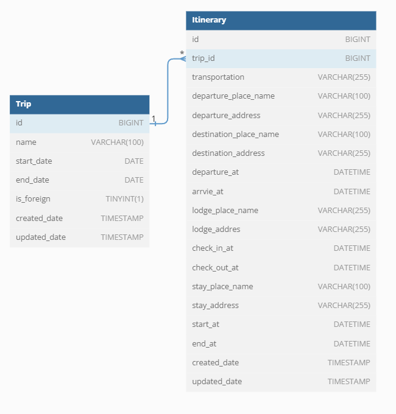

## API 테스트

### `POST` 여행 등록 (요청/응답 - 성공)

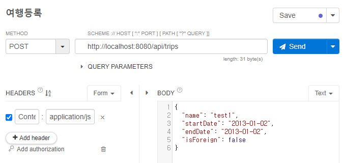
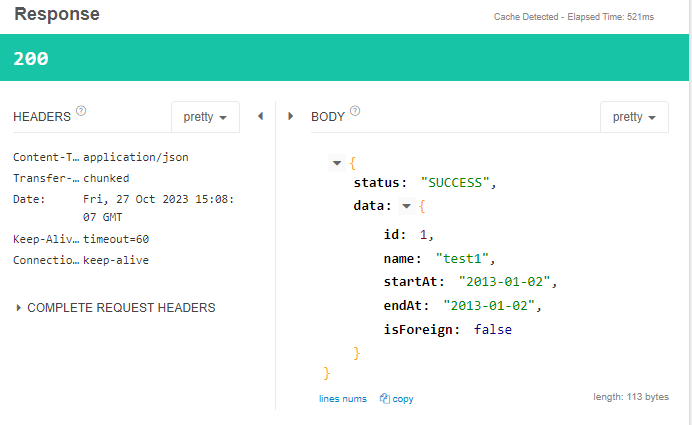
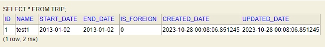

### `POST` 여행 등록 (요청/응답 - 실패 *notNull)

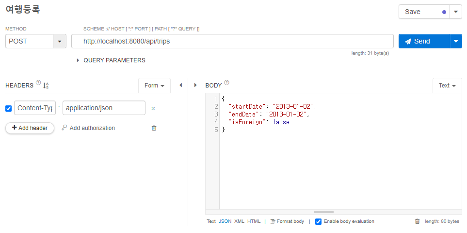
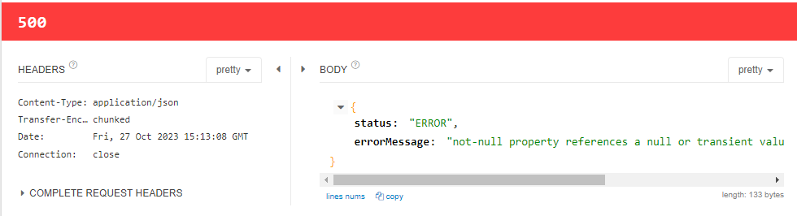

-----

### `GET` 여행 목록 조회 (요청/응답 - 성공)


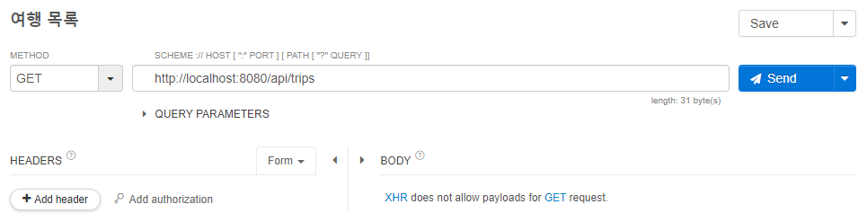
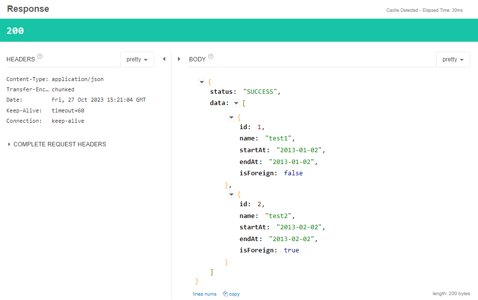

----

### `DELETE` 여행 삭제 (요청/응답 - 성공)

----

### `POST` 여정 복수 추가 (요청/응답 - 성공)

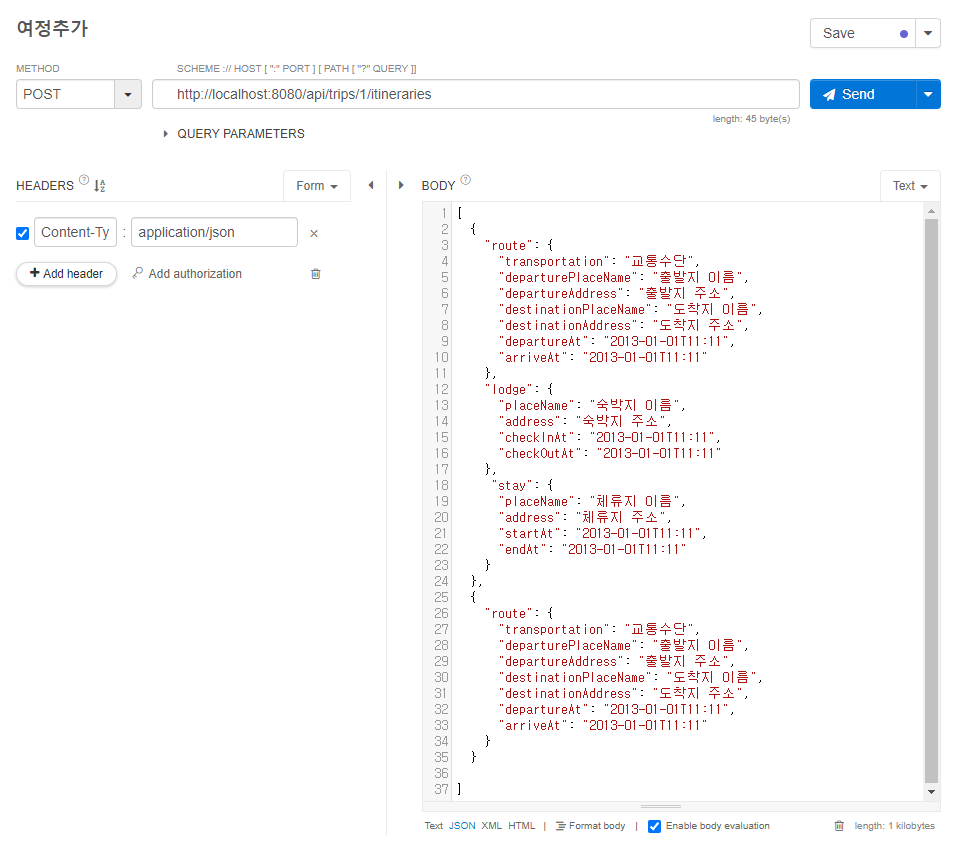
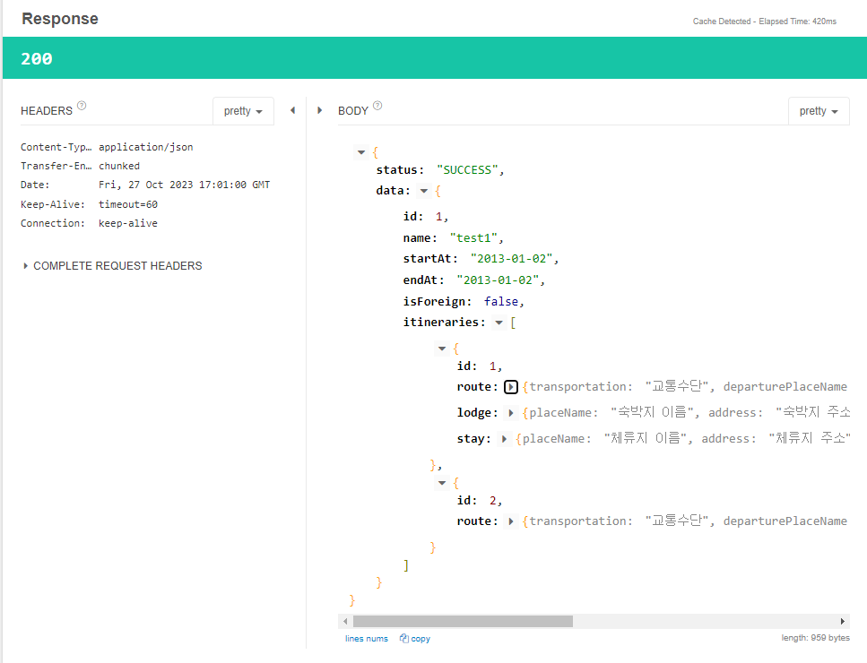
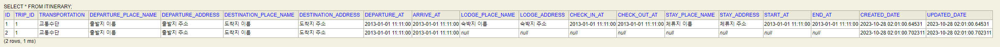

### `POST` 여정 복수 추가 (요청/응답 - 실패 * 없는 여행 ID)

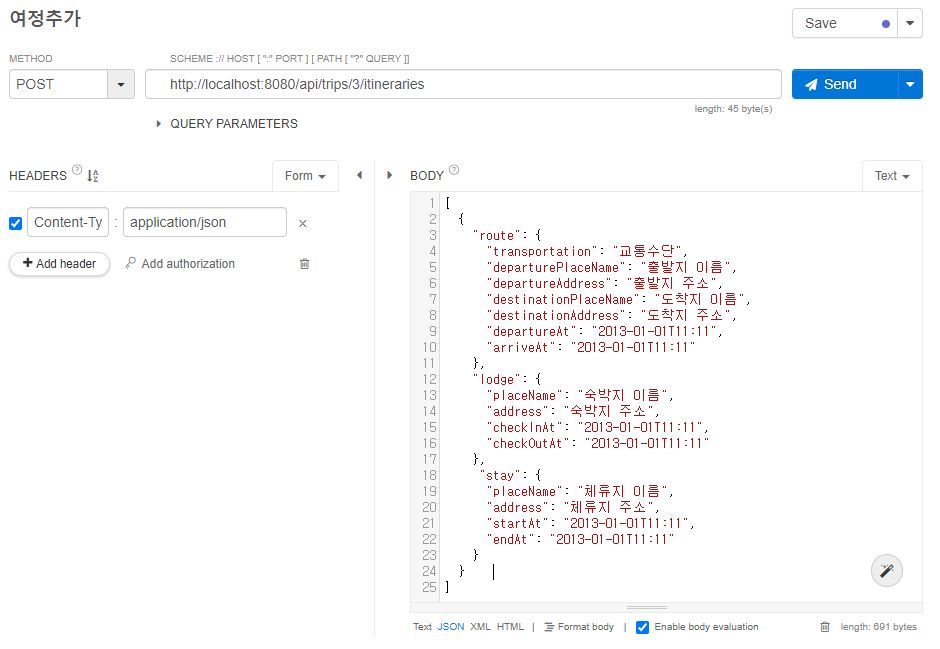
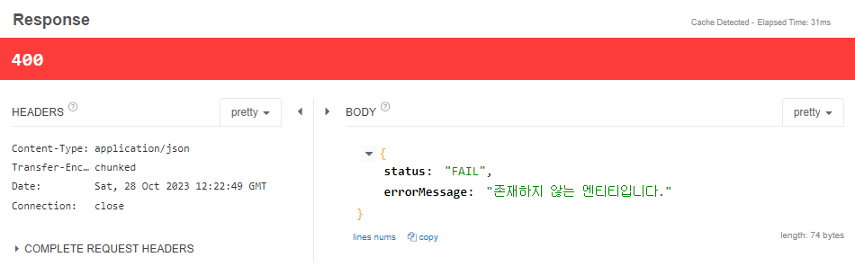

----

### `PUT` 여정 수정 (요청/응답 - 성공)

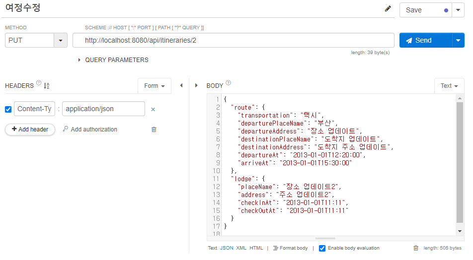
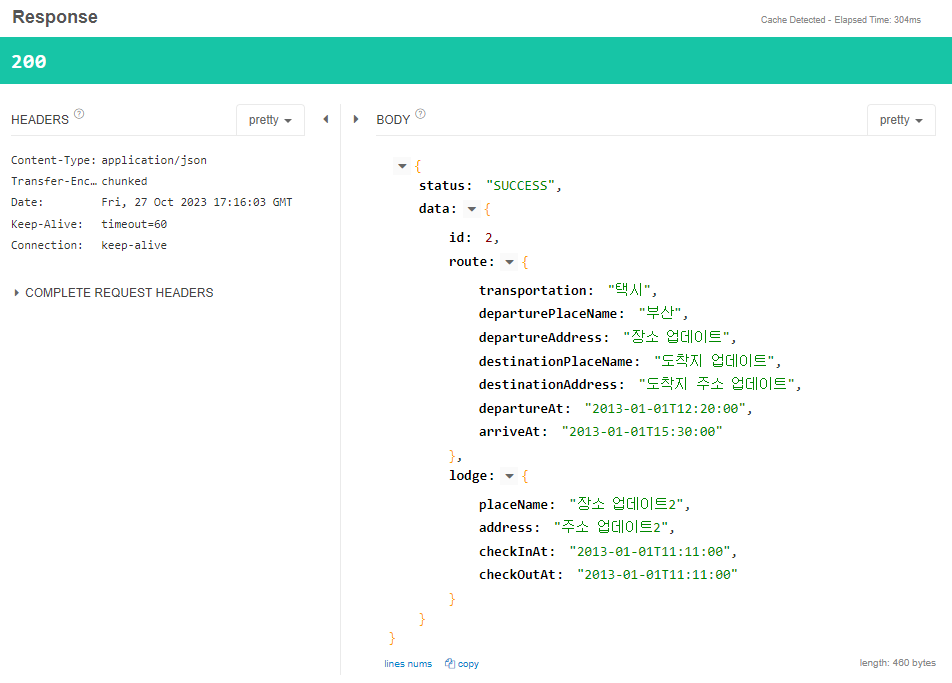
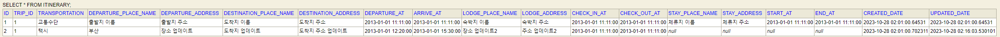

### `PUT` 여정 수정 (요청/응답 - 실패 *날짜 유효성)

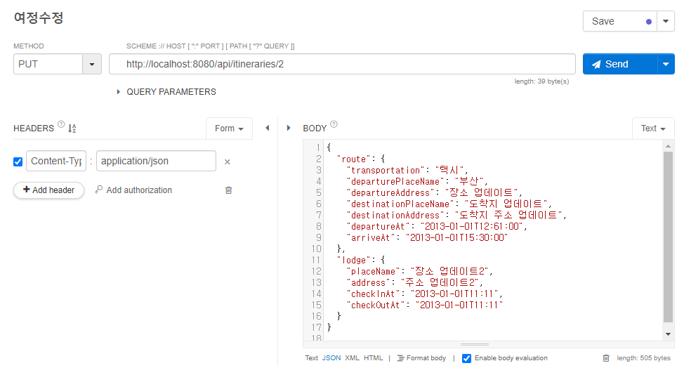
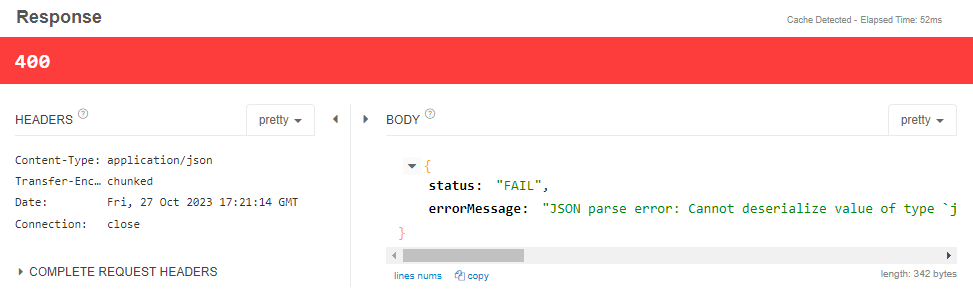

----

### `DELETE` 여정 삭제 (요청/응답 - 성공)

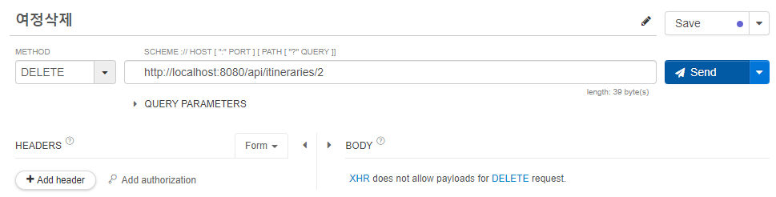
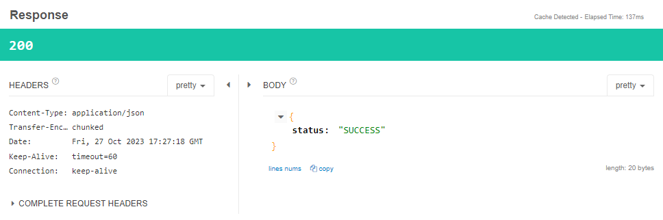


### `DELETE` 여정 삭제 (요청/응답 - 실패 *없는 여정 ID)

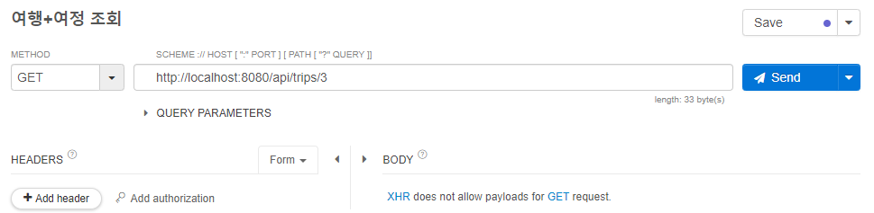
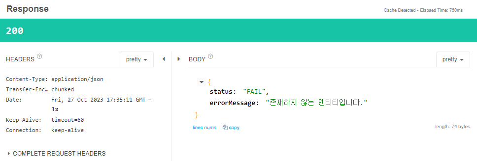

----

### `GET` 여행+여정 조회 (요청/응답 - 성공)

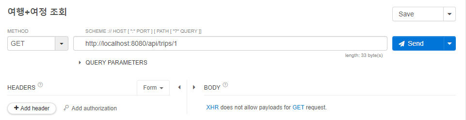
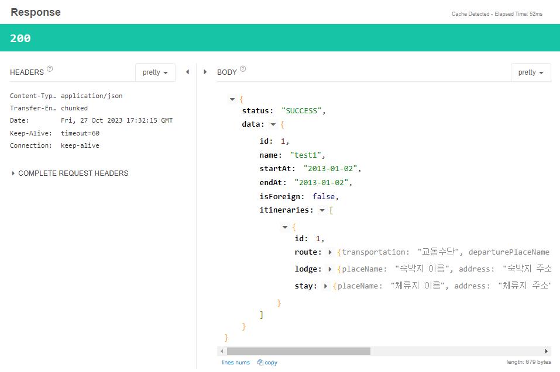

### `GET` 여행+여정 조회 (요청/응답 - 실패 *없는 여행 ID)

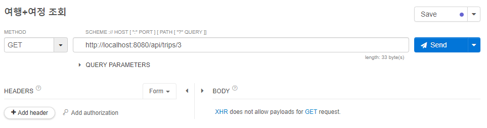
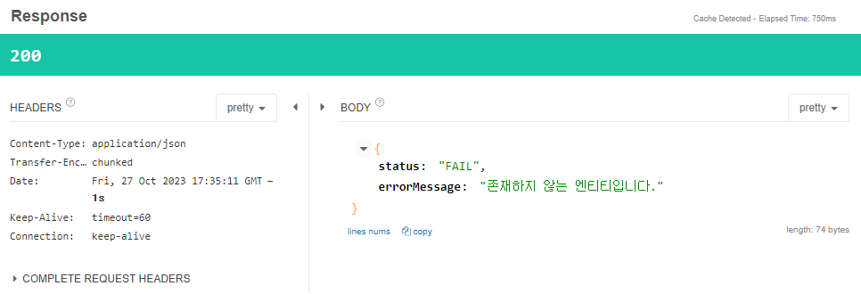

## 평가항목 별 커멘트

| 구분      | 내용                                                                                                                                                                                                                |
|---------|-------------------------------------------------------------------------------------------------------------------------------------------------------------------------------------------------------------------|
| API 설계  | REST API URL 설계 규칙에 어긋나지 않게 URL이 잘 구현되었는가.                                                                                                                                                                        |
|         | -> 네, URL주소는 명사로 구성하였고, 추가 사항으로 프론트 구현도 생각에 두어 모든 API앞에 /api를 붙여주었습니다.                                                                                                                                            |
|         | 적절한 HTTP method를 사용했는가                                                                                                                                                                                            |
|         | -> 데이터 조회 시 GET, 추가 시 POST, 삭제 시 DELETE를 사용했고, 업데이트 시 PATCH가 아닌 PUT을 사용하여 클라이언트로부터 모든 필드의 정보를 받아 기존 리소스를 완전히 대체하는 방식으로 구현하였습니다.                                                                                   |
| ERD 설계  | 각 테이블의 모든 컬럼들이 적절한 자료형을 사용했는가                                                                                                                                                                                     |
|         | ->  네...                                                                                                                                                                                                          |
|         | 테이블 간 연관관계를 적절히 설정하였는가                                                                                                                                                                                            |
|         | -> 테이블을 여행, 여정 총 2가지로 두었고, 여행을 여정이 1:n으로 참조하는 방식을 사용하였습니다. 여기서 route, lodeg, stay 테이블을 따로 만들지 않고 하나의 여정에 담은 이유는 여정 테이블에서 모든 컬럼을 생성해 만들어도 컬럼의 수가 충분히 많지 않고 개발 부분에서도 편의성을 얻을 수 있다 생각하여 여정 테이블 하나에 모든 데이터를 담게 되었습니다. |
| 프로젝트 구조 | Controller - Service - Repository를 각 계층에 맞게 사용했는가                                                                                                                                                                 |
|         | ->                                                                                                                                                                                                                |
|         | Entity와 DTO를 적절히 사용했는가                                                                                                                                                                                            |
|         | -> 클라이언트에게 데이터를 받을 땐 Reqeust DTO를 생성하여 받아주었고, 로직을 처리한 후 응답을 줄 땐 Response DTO를 사용하였습니다.                                                                                                                            |
|         | 일시에 대한 공통 유틸리티 클래스를 생성하여 활용했는가                                                                                                                                                                                    |
|         | -> 일시를 처리하는 공통 유티리티 대신, Dto↔Entity 변환해주는 TravelDtoConverter라는 공통 유틸리티 클래스를 생성하여 활용하였습니다.                                                                                                                          |
| 기능 확인   | 하나의 여행을 저장하는 기능이 구현되었는가                                                                                                                                                                                           |
|         | -> `POST` / api/trips , (이름, 시작일, 종료일, 해외/국내) 정보를 받아 저장하도록 하였습니다.                                                                                                                                                 |
|         | 여행 일정에 장소에 대한 정보도 추가하여 구현되었는가                                                                                                                                                                                     |
|         | ->                                                                                                                                                                                                                |
|         | 특정 여행에 여러 개의 여정을 기록하는 기능이 구현되었는가                                                                                                                                                                                  |
|         | -> `POST` /api/trips/{tripid}/itineraries , 한 개의 여정부터 복수 개의 여정까지 기록이 가능하도록 여정 정보를 List로 받아 처리하였습니다.                                                                                                               |
|         | 전체 여행 리스트를 조회하는 기능이 구현되었는가                                                                                                                                                                                        |
|         | -> `GET` /api/trips , 여행 목록 조회로, 여정을 제외한 여행 정보만 볼 수 있는 조회 기능을 만들었습니다.                                                                                                                                             |
|         | 특정 여행(에 포함된 여정 리스트도) 상세 정보를 조회하는 기능이 구현되었는가                                                                                                                                                                       |
|         | -> `GET` /api/trips/{tripid} , 여행 id를 받아 특정 여행을 선택하고 해당 여행 id로부터 여행 정보를 DB에서 찾아오고, 이 때 fetch join 을 통해 여정에 대한 엔티티도 함께 로드되도록 구현하였습니다.                                                                              |
|         | 특정 여행(에 포함된 여정 리스트는 제외하고)의 정보를 수정할 수 있는 기능이 구현되었는가                                                                                                                                                                |
|         | -> `PUT` /api/trips/{tripId} , 여행의 id를 통해 DB에서 특정 여행을 찾고 클라이언트로 부터 받은 정보로 수정할 수 있도록 구현하였습니다.                                                                                                                      |
|         | 특정 여정의 상세 정보를 수정할 수 있는 기능이 구현되었는가                                                                                                                                                                                 |
|         | -> `PUT` /api/itineraries/{id} , 여정의 id또한 고유하기 때문에 여행의 id없이 여정의 id만으로 DB에서 여정을 찾고, 수정할 수 있도록 구현하였습니다.                                                                                                             |
| 서비스 완성도 | API 문서에 모든 기능을 포함하고, Request/Response에 대해 명확히 설명하였는가                                                                                                                                                              |
|         | ->                                                                                                                                                                                                                |
|         | 여행 등록 컬럼에 맞지 않는 데이터 등록 시도 시 오류 메세지를 출력하는가                                                                                                                                                                         |
|         | -> 예상한 에러에 대해서는 200, 바인딩 에러는 400, 나머지는 500으로 컨벤션을 정하였습니다.                                                                                                                                                         |
|         | 여행 조회 및 수정 시 없는 데이터라면 오류 메세지를 출력하는가                                                                                                                                                                               |
|         | -> 예상한 에러에 대해서는 200, 바인딩 에러는 400, 나머지는 500으로 컨벤션을 정하였습니다.                                                                                                                                                         |
|         | 모든 기능이 정상적으로 동작하는가                                                                                                                                                                                                |
|         | ->                                                                                                                                                                                                                |
